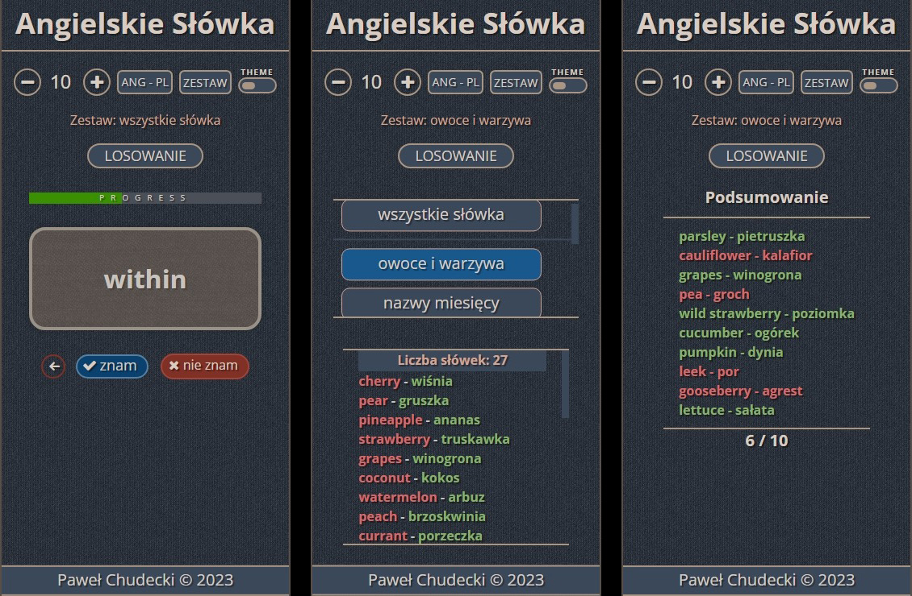
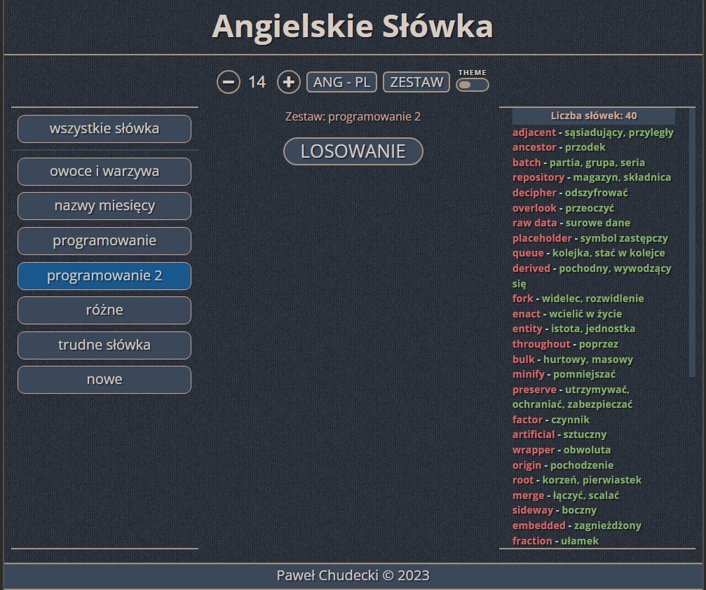
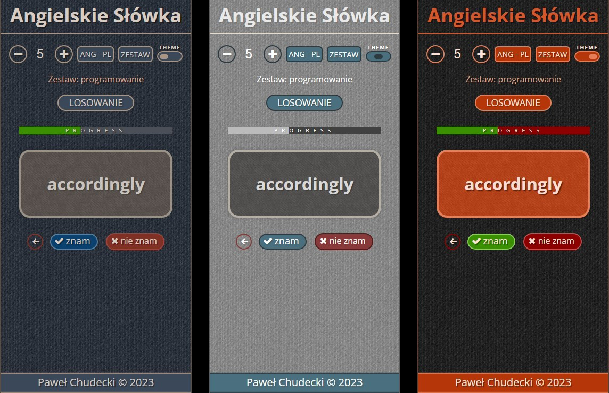
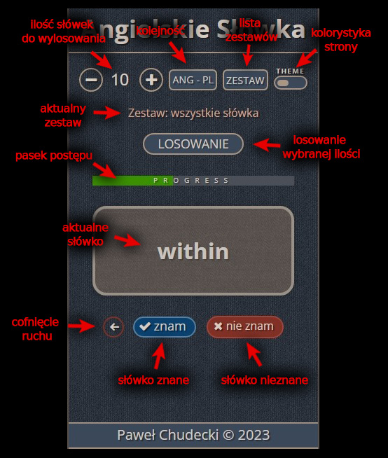

# Angielskie-Slowka
Strona do nauki angielskich słówek metodą fiszek.

[Link do stryny](https://soulrvr29.github.io/Angielskie-Slowka/)

### Ekran główny, listy słówek i podsumowania.

### Ekran listy słówek w trybie desktop.

### Wersje kolorystyczne.

### Funkcjonalność strony.

